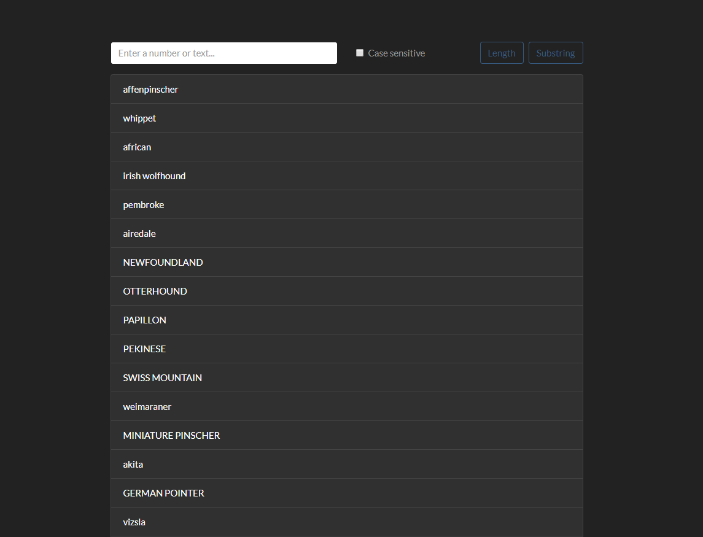

### In this application, we get data from the server, and then filter it by the length of the words or substring that the user indicates.
  
- Technology Stack: ES6-7, React, Bootstrap, FetchAPI  

**[Link to app](https://mr-testtask.herokuapp.com/)**
